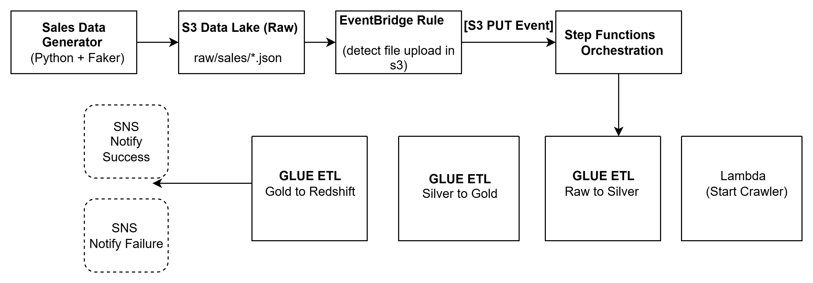

📊 Sales ETL Pipeline – End-to-End Workflow
1. Overview

This project implements a modern ETL pipeline on AWS to process, clean, and analyze sales data. It follows a multi-layered data lake architecture (Bronze → Silver → Gold) and integrates with Amazon Redshift for analytics. The pipeline is event-driven, secure, and production-ready, using Infrastructure as Code (Terraform).

2. Architecture

Components Involved:

S3 Data Lake

Bronze Layer (raw/) → Raw JSON files from sales data generator.

Silver Layer (silver/) → Cleaned & standardized Parquet files.

Gold Layer (gold/) → Aggregated, analytics-ready csv files

EventBridge → Detects new file uploads in Bronze (raw/) and triggers Step Functions.

Step Functions → Orchestrates ETL workflow.

Lambda → Invokes Glue Crawler (to refresh Glue Catalog metadata).

Glue Crawler → Updates schema in Glue Data Catalog.

Glue ETL Jobs

Bronze → Silver (cleaning, schema enforcement, handling messy data).

Silver → Gold (aggregation into fact & dimension datasets).

Gold → Redshift (load fact/dim tables).

Redshift

Final destination for analytics.

Contains Fact Table (fact_sales) and Dimension Tables (dim_store, dim_product, dim_customer).

SNS (Notifications) → Sends email alerts on pipeline success/failure.

Secrets Manager → Stores Redshift credentials and SNS email securely (no hardcoding).

CloudWatch

Logs (Glue, Lambda, Step Functions).

Metrics (via CloudWatch Metric Filters).

Alarms (trigger SNS if ERRORs detected).

3. Workflow Execution

Data Ingestion

Synthetic sales data (~50MB–5GB) is generated and uploaded to s3://<bucket>/raw/sales/.

Triggering

S3 PUT event triggers EventBridge rule.

EventBridge starts the Step Function execution.

Step Functions Orchestration

Step 1: Lambda triggers Glue Crawler → updates Glue Catalog.

Step 2: Glue ETL (Raw → Silver) cleans data (removes nulls, invalid values, formats).

Step 3: Glue ETL (Silver → Gold) aggregates into fact/dim schema.

Step 4: Glue ETL (Gold → Redshift) loads Parquet files into Redshift fact/dim tables.

Step 5: SNS sends notification (Success/Failure).

Data Storage

Raw (JSON), Cleaned (Parquet), and Aggregated (Parquet) remain in S3.

Analytics-ready tables stored in Redshift for BI/SQL queries.

4. Security & IAM

IAM Roles with least-privilege access for Glue, Step Functions, EventBridge, SNS, Redshift.

Secrets Manager stores:

Redshift Username

Redshift Password

Redshift Copy Role ARN

SNS Email

No credentials hardcoded in Terraform or code.

S3 Buckets use encryption (SSE-S3), versioning enabled.

5. Monitoring & Alerts

CloudWatch Log Groups for Glue Jobs, Lambda, Step Functions.

Metric Filters → Count occurrences of ERROR, Exception, Failed, RuntimeError.

Alarms → If ErrorCount > 0, SNS sends immediate notification.

6. Fact & Dimension Model

Fact Table: fact_sales

transaction_id, date, store_id, product_id, customer_id, quantity_sold, unit_price, total_amount, payment_method.

Dimension Tables:

dim_store → store_id, store_name, city.

dim_product → product_id, product_name, category.

dim_customer → customer_id, customer_name.

This schema supports efficient reporting, slicing, and aggregations.

7. Deployment

Terraform Modules:

iam/ → IAM roles and policies.

s3/ → Data lake buckets.

glue/ → Crawlers, ETL jobs.

redshift_cluster/ → Redshift cluster and subnet groups.

step_functions/ → Workflow orchestration.

eventbridge/ → Rules for file upload triggers.

sns/ → Notification topics.

secrets_manager/ → Secure credentials storage.

cloudwatch/ → Log groups, metric filters, alarms.

Environment-Specific tfvars (e.g., env/dev.tfvars) hold config values like VPC IDs, log group names, bucket names, etc.

GitHub Actions CI/CD automates plan, apply, linting, and tests.

8. Scaling

Horizontal scaling: Add more Glue workers, parallel Step Function branches, partition data by date.

Vertical scaling: Use larger Redshift node types (ra3.4xlarge, etc.), increase Glue DPUs.

9. Key Advantages

Event-driven, fully automated ETL.

Secure (Secrets Manager).

Modular Infrastructure as Code (Terraform).

Scalable architecture (both in storage and compute).

Monitoring + Alerts for production reliability.

10. How to Run

Generate synthetic sales data (python data_generator.py).

Upload file to S3 → triggers pipeline automatically.

Monitor pipeline in Step Functions console.

Query Redshift:

SELECT COUNT(*) FROM fact_sales;
SELECT * FROM dim_store LIMIT 10;

Check SNS emails for status alerts.